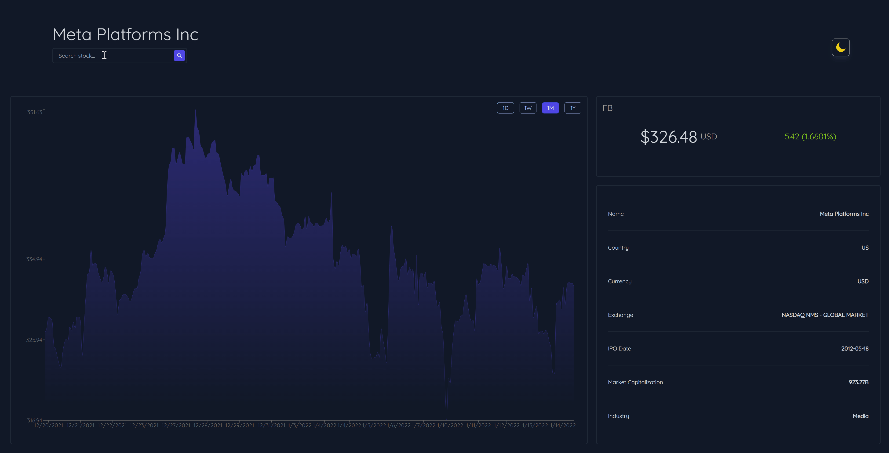
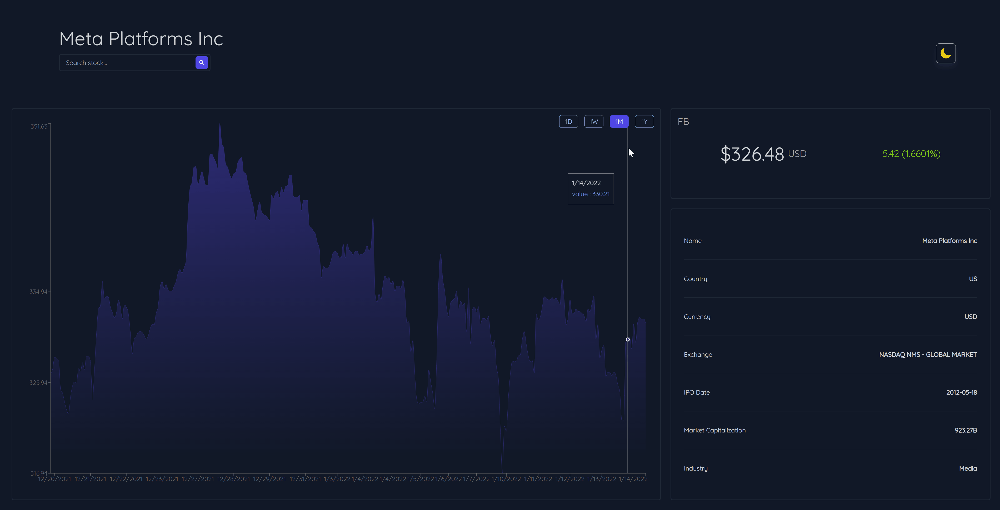
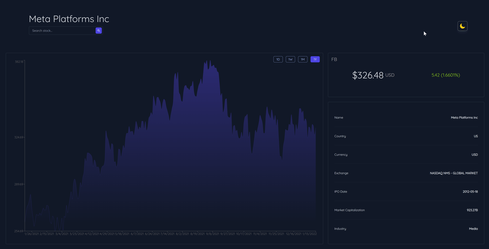

# Stock Dashboard App
This project is a stock dashboard app that uses the [Finnhub API](https://finnhub.io/)

- 🔍 Search for a stock (e.g. AAPL, FB, GOOG)

- 💸 Quote a stock (current price, percent change)

- 📝 Get more details of a stock (name, currency, market cap, etc.)

- 📈 View historical chart data of a stock (day/week/month/year)

- 🌙 Select theme (dark/light)

## Tech Stack
  

## Examples

### Search

### Date Filter

### Select Theme

## Subsections
If you are interested in following along this tutorial, here are the subsections (with links to the code for each part)

| Branch                                                            	| Description                            	|
|-------------------------------------------------------------------	|----------------------------------------	|
| [Part 1](https://github.com/DLabbate/stock-dashboard/tree/part-1) 	| Introduction                           	|
| [Part 2](https://github.com/DLabbate/stock-dashboard/tree/part-2) 	| Setup (TailwindCSS, Google Fonts, ...) 	|
| [Part 3](https://github.com/DLabbate/stock-dashboard/tree/part-3) 	| Grid Layout                            	|
| [Part 4](https://github.com/DLabbate/stock-dashboard/tree/part-4) 	| React Components & Styling             	|
| [Part 5](https://github.com/DLabbate/stock-dashboard/tree/part-5) 	| Recharts (Plotting Data)               	|
| [Part 6](https://github.com/DLabbate/stock-dashboard/tree/part-6) 	| Dark Mode (React Context)              	|
| [Part 7](https://github.com/DLabbate/stock-dashboard/tree/part-7) 	| Fetching Data from REST API (Finnhub)  	|
| [Part 8](https://github.com/DLabbate/stock-dashboard/tree/part-8) 	| Transitions & Animations               	|
